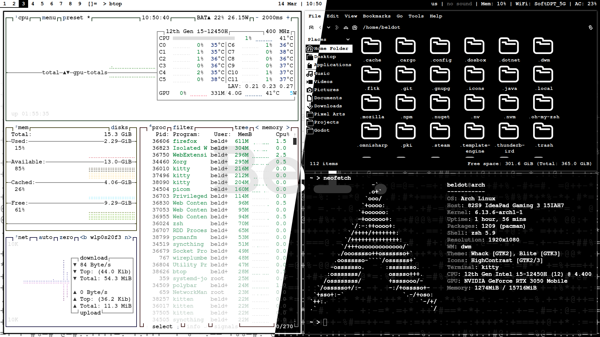

# My DWM Arch Linux setup

---
This is git repo for my dwm setup on Arch Linux, with config files for other stuff.

### Utilities
- Display server: X11
- Window Manager: dwm with following patches:
    - actualfullscreen
    - alwayscenter
    - anybar
    - cool-autostart
    - gridmode
    - ipc
    - movestack
    - noborder (also patched by me to exclude tiling mode, works only for monocle)
    - pertag
    - vanitygaps
    - autodarkmode
    - alpha (fixborders)
- Status bar: Polybar
- Process manager: btop
- App launcher: rofi
- Terminal emulator: kitty
- Audio visualizer: cava
- Shell: zsh
- Dark mode switch utility: darkman
- Screen temperature: redshift
- GTK theme: Blite/Whack (Basically KDE's Breeze with my personal changes. It's not perfect, but mostly acceptable)

